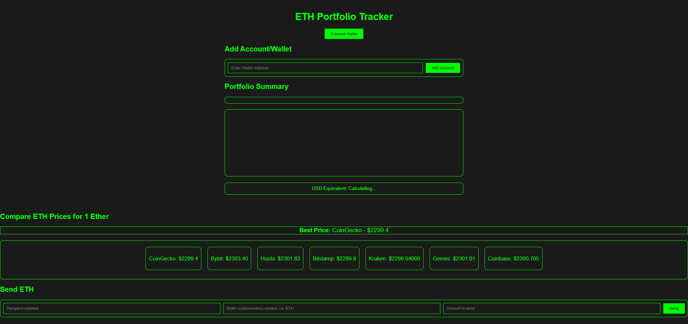

# Cryptocurrency Portfolio Tracker

Track your Ethereum (ETH) investments and balances with this simple web-based cryptocurrency portfolio tracker.

## Features

- **Connect Your Wallet**: Easily connect your Ethereum wallet (e.g., MetaMask) to view your account details and balances.
- **Add Multiple Accounts**: Keep track of investments across multiple Ethereum accounts.
- **Portfolio Summary**: See an overview of your account balances in Ether (ETH).
- **PWA Support**: Install the tracker on your device for quick access.
- **Send Cryptocurrency**: Send Ether (ETH) to other addresses directly from the tracker.

## Getting Started

1. Visit the [Cryptocurrency Portfolio Tracker](https://arittra-bag.github.io/BITS-API-Hackathon/).

2. Click the "Connect Wallet" button to connect your Ethereum wallet (e.g., MetaMask). Make sure your wallet is unlocked.

3. Once connected, you'll see your account address and balance. You can add multiple accounts by clicking "Add Account."

4. Track your Ethereum investments and view your portfolio summary.

5. Use the "Send" button to send Ether (ETH) to other addresses directly from the tracker.

## Installation (PWA)

This web application supports Progressive Web App (PWA) installation. To install it on your device, follow these steps:

1. Visit the [Cryptocurrency Portfolio Tracker](https://arittra-bag.github.io/BITS-API-Hackathon/).

2. Click the "Install" or "Add to Home Screen" option in your browser (if available).

3. The tracker will be installed as a PWA and accessible from your device's home screen.

## Future Enhancements

This cryptocurrency portfolio tracker is currently focused on Ethereum (ETH). Future enhancements may include:

- Support for tracking other cryptocurrencies (e.g., Bitcoin, Litecoin).
- More detailed investment analysis and charting.
- Integration with external APIs for real-time data.

## Contributing

Contributions to this project are welcome. You can contribute by creating issues, suggesting improvements, or sending pull requests. 

## License

This project is licensed under the [MIT License](LICENSE).

## Acknowledgments

- This project was developed as part of the BITS Pilani Postman API Hackathon 3.0.

## Contact

For questions or feedback, you can reach out to [Arittra Bag](mailto:arittrabag@gmail.com).
